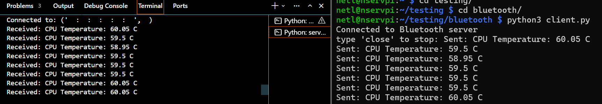

# Bluetooth Telemetry Pi to Laptop

1. **Project Description**

This directory demonstrates a cross-platform IoT telemetry system using Bluetooth RFCOMM sockets. A Raspberry Pi (Client) reads live CPU temperature data and transmits it wirelessly to a Windows laptop (Server). The system utilizes multithreading on the client side to allow simultaneous data transmission and command listening, ensuring the Pi remains responsive to remote instructions.

The project illustrates:
- How to set up a bluetooth Python socket server and client.
- Safe transmission and handling of data.
- Clean shutdown and acknowledgement process.

Prerequisites
Raspberry Pi: BlueZ installed and Bluetooth "Compatibility Mode" enabled (bluetoothd -C).

Laptop: Bluetooth adapter capable of accepting incoming RFCOMM connections.

Python Libraries:
python-dotenv

2. **How to Run**

### 1. Create a .env file in the root directory (this file is ignored by Git for security):

BT_SERVER_MAC=00:11:22:33:44:55  # Your laptop's Bluetooth MAC
BT_CHANNEL=4                     # The RFCOMM channel used for binding

### 2. Start the Server

In one terminal, navigate to the project directory and run:

```bash
python server.py
```

You should see:
```
Waiting for Bluetooth client connection...
```

### 2. Start the Client

In another terminal, ensure you're in the same directory and run:

```bash
python client.py
```

The Pi will establish a handshake, begin reading /sys/class/thermal/thermal_zone0/temp, and stream data every 5 seconds.

To stop the communication, type `close` in the client terminal.

### 3. Clean Shutdown

When the client sends the `close` command:
- The server responds with `"close"`.
- Both client and server will notify you of the closed connection.

3. **Test Results**

| Test Scenario | Result |
| :--- | :--- |
| **Bluetooth Pairing** | Successfully paired and trusted via `bluetoothctl`. |
| **Telemetry Accuracy** | Pi CPU temp matched `vcgencmd measure_temp` readings. |
| **Range Test** | Stable connection maintained up to ~10 meters. |
| **Concurrency** | Sending thread continued while the main thread waited for user input. |

## Example Screenshot


 Left: server.py
 Right: client.py
---
