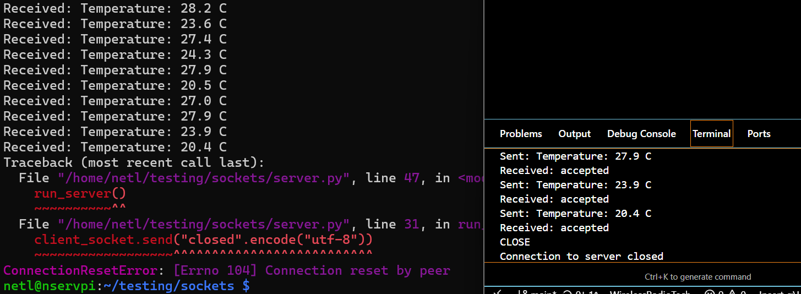

README must include
short project description

How to run the server and the client

test results (localhost + second device)

at least one screenshot

# Socket Protocol Example

1. **Project Description**

This directory demonstrates a simple client-server communication using TCP sockets in Python. The `server.py` script implements a TCP server that receives temperature messages from the client and can gracefully handle connection closures. The `client.py` script connects to the server, periodically sends random temperature readings, and allows the user to terminate the session with a command.

The project illustrates:
- How to set up a Python socket server and client.
- Safe transmission and handling of data.
- Clean shutdown and acknowledgement process.

2. **How to Run**

### 1. Start the Server

In one terminal, navigate to the `socketProtocol` directory and run:

```bash
python server.py
```

You should see:
```
Listening on 127.0.0.1:8000
```

### 2. Start the Client

In another terminal, ensure you're in the same directory and run:

```bash
python client.py
```

You should see:
```
Connected to server 127.0.0.1:8000
Sent: Temperature: xx.x C
Received: accepted
...
```

To stop the communication, type `close` in the client terminal.

### 3. Clean Shutdown

When the client sends the `close` command:
- The server responds with `"closed"`.
- Both client and server will notify you of the closed connection.

3. **Test Results**

### Localhost Test

- The server and client were both run on the same computer (`127.0.0.1:8000`).
- The client was able to successfully connect, send multiple temperature messages, and receive acknowledgements from the server.
- Upon sending the `close` command, both sides shut down cleanly.

### Second Device Test

- To test with two devices on the same network, I replaced the IP address and port in `client.py` and `server.py` with my homelab raspberryPi's IP address and port 9999 to avoid port conflicts.
- Successful data exchange and clean shutdown.

## Example Screenshot


 Left: server.py
 Right: client.py
---
